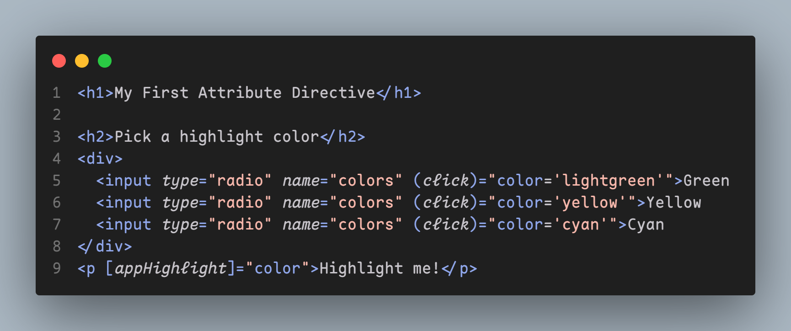
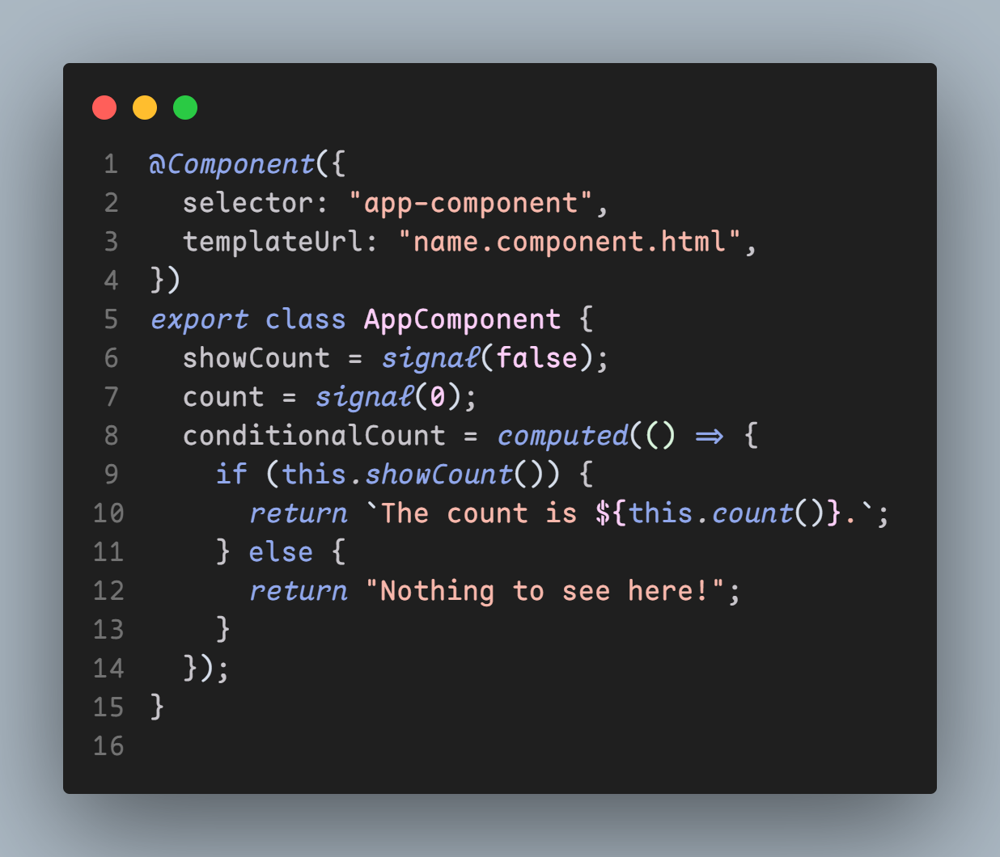
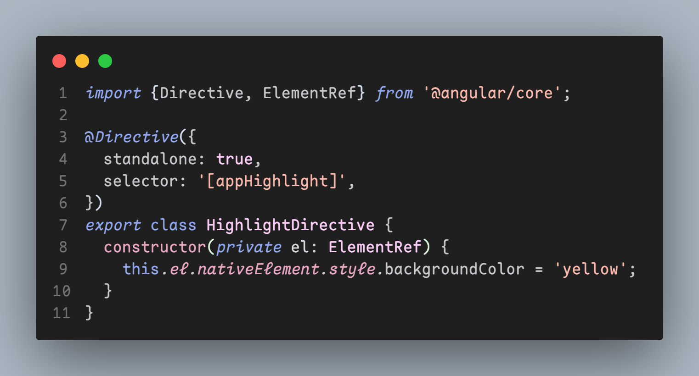
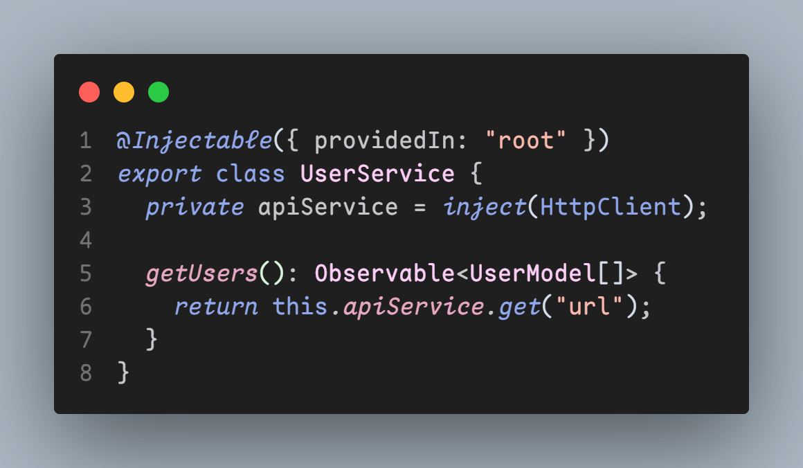

<div align="center">

<h1>Angular.dev Theme</h1>
</div>

```json
"editor.fontLigatures": true,
"editor.lineHeight": 24,
"editor.letterSpacing": 0.3,
"editor.fontSize": 17,
"editor.fontFamily": "Maple mono",
"editor.fontWeight": 400,
```

## Screenshots





